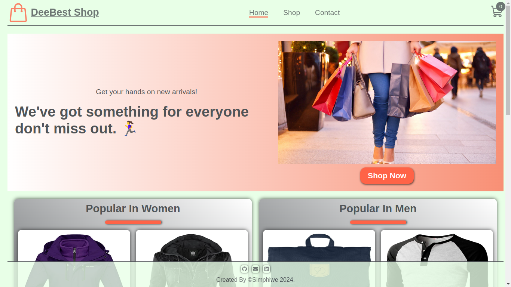
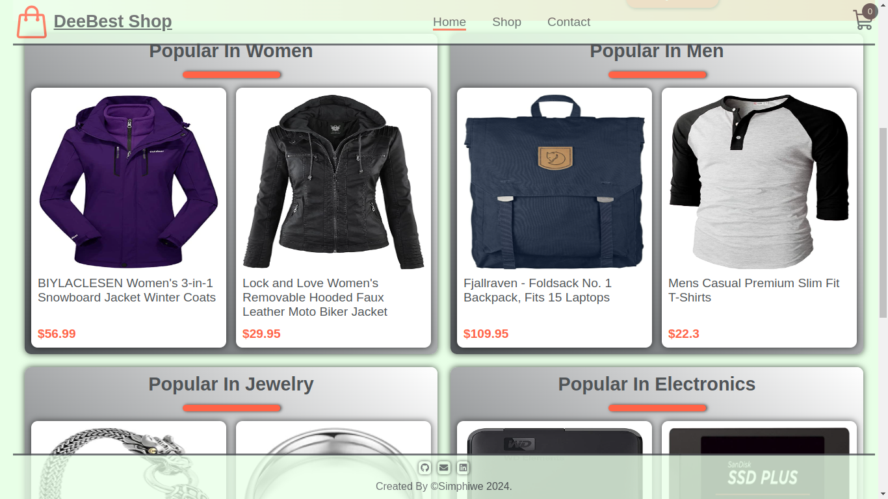
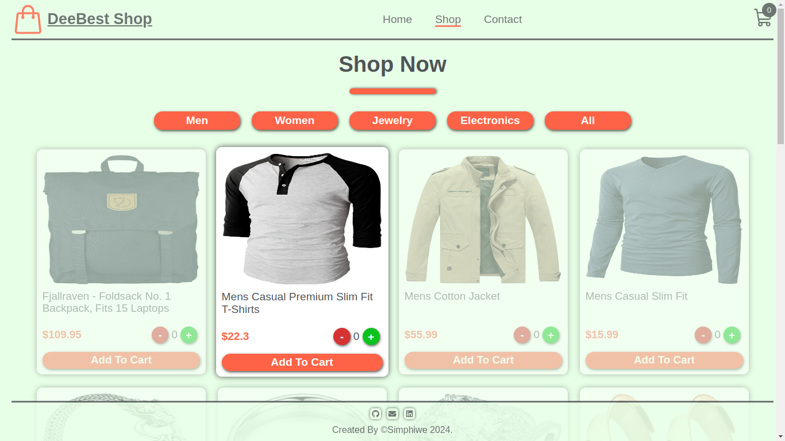
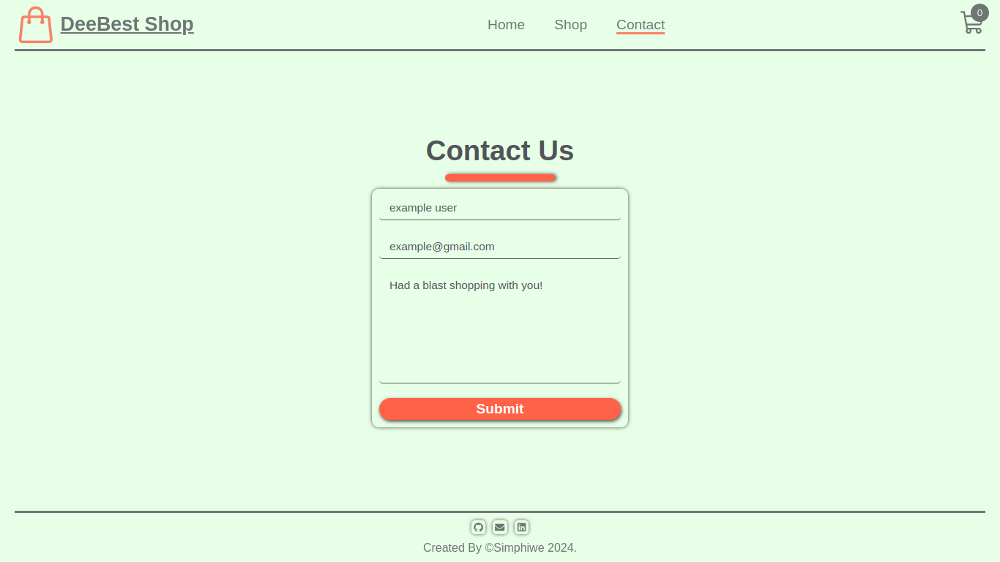

# SHOPPING CART

Check it _**LIVE**_ 👉
**<https://deebest.github.io/shopping-cart/>**

A multi page _**Shopping Cart**_ web application I built with HTML,CSS,JavaScript and React. It's multi page application, I used react router dom. Notifications are displayed when items are added or deleted in the cart, I use toastify for that and I use react icons for the icons. I fetch the items from a free api called fakeStore api.

## Uses

It simulates real life online shopping store with multiple pages, and shopping items to choose from and add them to the cart.

## Tech Stack Used

- GIT
- HTML
- CSS
- JavaScript
- React

## Get In Touch 👇

Email : **<simphiwedladla8@gmail.com>**

Linked: **<https://www.linkedin.com/in/dladla-simphiwe-89061a20a/>**

Github: **<https://github.com/DeeBest>**

Portfolio: **<https://deebest.github.io/personal-webpage/>**

## Credits

images from the FakeStore api, link below.
**<https://fakestoreapi.com/>**
